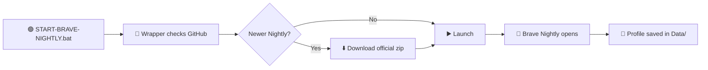

# 🦁 Brave Nightly Portable

> **Unofficial** portable [Brave Browser **Nightly**](https://brave.com/download-nightly/) for Windows — [PortableApps.com Format](https://portableapps.com/development/portableapps.com_format), auto-updates from **official GitHub**, profile stays on your USB/drive.

---

## ⚡ Start here (3 seconds)

### 👉 **Double-click `START-BRAVE-NIGHTLY.bat`** in this folder

That’s it. No install. No admin. No registry junk on the host PC.

```
📁 Brave-Portable/
   └── 🟢 START-BRAVE-NIGHTLY.bat   ← DOUBLE-CLICK THIS FIRST
       └── 📁 BraveNightlyPortable/
```

**First launch?** The app downloads ~230 MB of **official Brave Nightly** from GitHub. Grab a coffee ☕ — it only happens once (then only small updates).

**Already have a Release zip?** Same thing — double-click the `.bat` inside the extracted folder.

---

## 🎬 What happens when you launch



| Step | What it does |
|------|----------------|
| 1️⃣ | Checks [brave/brave-browser](https://github.com/brave/brave-browser/releases) for latest **Nightly** |
| 2️⃣ | Downloads `brave-v*-win32-x64.zip` if needed (never the Setup.exe installer) |
| 3️⃣ | Verifies build is **Brave Browser Nightly** (rejects stable/beta) |
| 4️⃣ | Updates `App\Brave\` only — your **bookmarks, extensions, cookies** in `Data\profile\` are **never touched** |
| 5️⃣ | Opens Brave with portable paths (`--user-data-dir`, disabled built-in updater) |

---

## ✅ Is this really Nightly?

**Yes.** Every download is verified:

| Check | Value |
|-------|--------|
| GitHub release name | Must contain **Nightly** |
| Asset | `brave-vX.Y.Z-win32-x64.zip` only |
| After download | `ProductName` = **Brave Browser Nightly** |

Stable and Beta builds are **rejected** automatically.

---

## 📁 Folder map

```
Brave-Portable/
├── 🟢 START-BRAVE-NIGHTLY.bat          ← YOU START HERE
├── 📖 README.md
├── 🔧 build.ps1                        ← rebuild wrapper (developers)
├── 📁 wrapper/                         ← C# update-on-launch source
├── 📁 .github/workflows/               ← auto-release on new Nightly
└── 📁 BraveNightlyPortable/             ← the portable package
    ├── 🟢 Launch Brave Nightly.bat     ← shortcut (same as .bat above)
    ├── 🔵 BraveNightlyPortable-AlexRabbit.exe   ← wrapper (update + go)
    ├── 🔵 BraveNightlyPortable-Internal.exe     ← PA launcher (paths/registry)
    ├── 📁 App/
    │   ├── Brave/                      ← browser binaries (auto-downloaded)
    │   └── AppInfo/                    ← PortableApps.com config
    ├── 📁 Data/                        ← YOUR profile (created on first run)
    └── 📁 Other/Source/
        ├── update.bat                  ← manual update
        └── Update-BraveNightly.ps1
```

---

## 🧰 Requirements

| Requirement | Details |
|-------------|---------|
| 🖥️ OS | Windows 10/11 **64-bit** |
| 🌐 Network | First run + updates need internet |
| 💾 Space | ~500 MB free (browser + profile) |
| 🔐 Admin | **Not required** |

---

## 🚀 Usage modes

### 🟢 Normal user — just use the `.bat`

```
Double-click START-BRAVE-NIGHTLY.bat
```

Alternative inside the package folder:

```
Double-click Launch Brave Nightly.bat
```

### 🔄 Manual update only

```
BraveNightlyPortable\Other\Source\update.bat
```

### 🧩 PortableApps.com Platform

Copy the entire `BraveNightlyPortable` folder into your `PortableApps\` directory. The Platform reads `App\AppInfo\appinfo.ini` automatically.

### 👨‍💻 Developer — rebuild the wrapper

```powershell
.\build.ps1
```

Requires .NET 8 SDK (or the script installs a local SDK into `tools\` on first run).

---

## 🌐 Update sources (official only)

| Source | Used? | Why |
|--------|-------|-----|
| ✅ `github.com/brave/brave-browser/releases` | **Yes** | Official Nightly zip assets |
| ✅ GitHub API + HTML fallback | **Yes** | Version check |
| ❌ `laptop-updates.brave.com/.../nightly` | **No** | Returns `Setup.exe` installer — breaks portability |
| ❌ Brave built-in updater | **Disabled** | Would install to Program Files |

---

## 📦 GitHub Releases

Automated workflow (every 6 hours + manual trigger):

- Downloads latest official Nightly
- Builds the wrapper exe
- Publishes `BraveNightlyPortable_X.Y.Z_win64.zip`

**Recommended for end users:** download the **Release zip**, extract, double-click **`START-BRAVE-NIGHTLY.bat`**.

---

## 🔒 Privacy & portability

| Data | Location |
|------|----------|
| Profile, bookmarks, extensions | `BraveNightlyPortable\Data\profile\` |
| Cache | `BraveNightlyPortable\Data\cache\` |
| Browser binaries | `BraveNightlyPortable\App\Brave\` |

Move the whole folder to another PC or USB — it keeps working. Enable **Brave Sync** if you want settings across machines (Chromium encryption can be machine-bound on Windows).

---

## ⚠️ Disclaimer

- **Unofficial** — not affiliated with Brave Software or PortableApps.com
- **Nightly channel** — bleeding edge, may be unstable; not for production
- **Trademarks** — Brave® is a trademark of Brave Software, Inc.
- Browser licensed under **MPL 2.0**; wrapper code under **MIT** (see [LICENSE](LICENSE))

---

## 🛠️ Troubleshooting

| Problem | Fix |
|---------|-----|
| 🚫 “Could not find launcher” | Run `build.ps1` or download a GitHub **Release** zip |
| 🐌 First launch slow | Normal — downloading ~230 MB Nightly from GitHub |
| 🔄 Update fails silently | Run `Other\Source\update.bat` to see errors |
| 🚫 Brave won’t start | Ensure `BraveNightlyPortable-Internal.exe` is in the package root |
| 📛 Not Nightly in About | Run manual update; stable builds are blocked but old installs may remain |

---

## 🤝 Contributing

Issues and PRs welcome. For PortableApps.com submission, this follows PA.c Format 3.9 with unofficial `AppId` suffix.

---

## 📚 Links

- 🦁 [Brave Browser](https://brave.com/)
- 🌙 [Brave Nightly downloads](https://brave.com/download-nightly/)
- 📦 [Official GitHub releases](https://github.com/brave/brave-browser/releases)
- 📘 [PortableApps.com Format spec](https://portableapps.com/development/portableapps.com_format)
- 📘 [PA Launcher manual](https://portableapps.com/manuals/PortableApps.comLauncher/)

---

<p align="center">
  <strong>Made with 🧡 for portable privacy browsing</strong><br>
  Double-click <code>START-BRAVE-NIGHTLY.bat</code> and go 🚀
</p>
